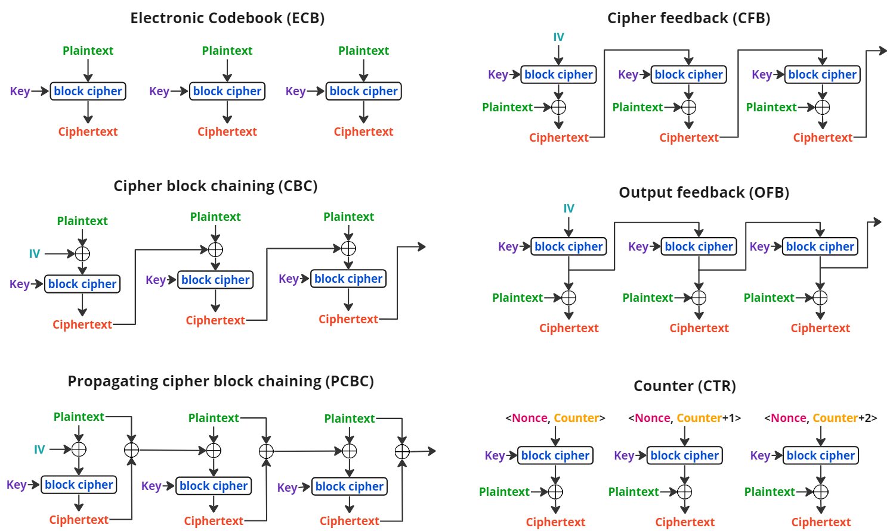
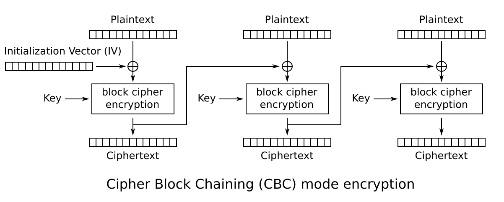
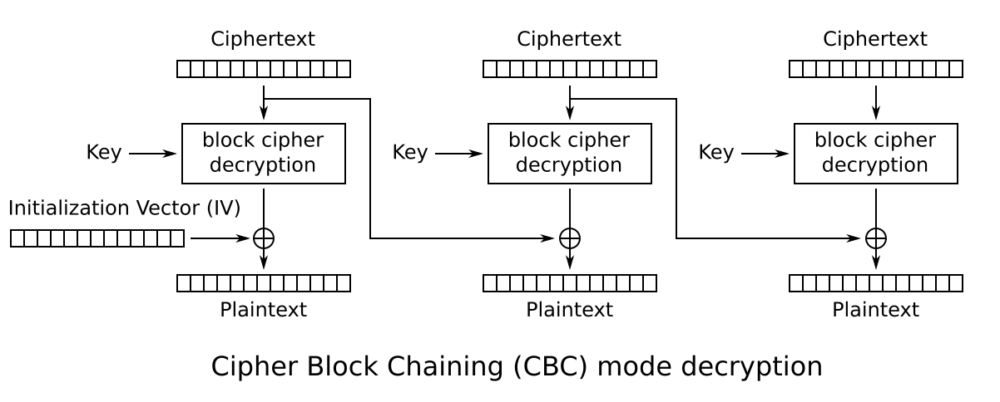
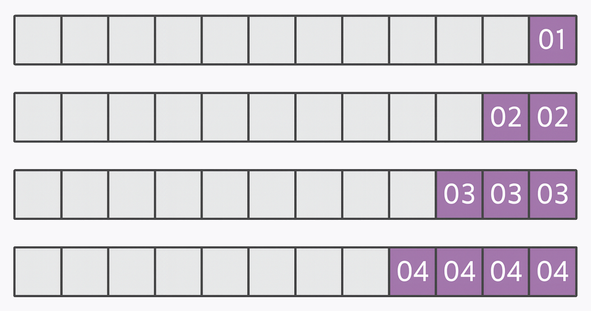
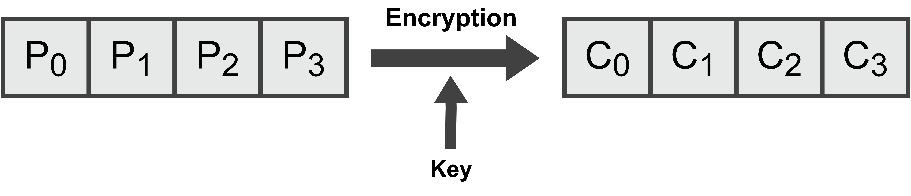
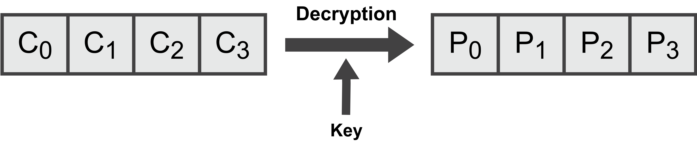
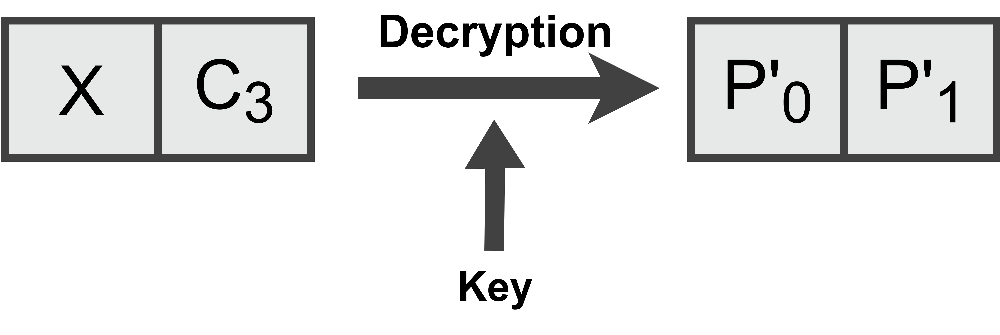
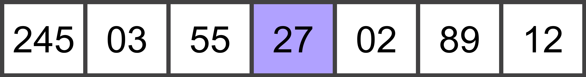
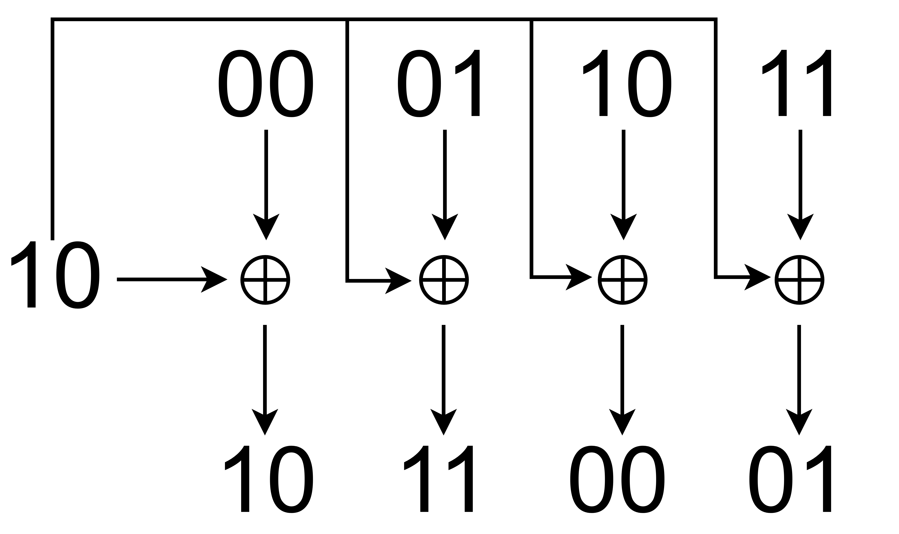
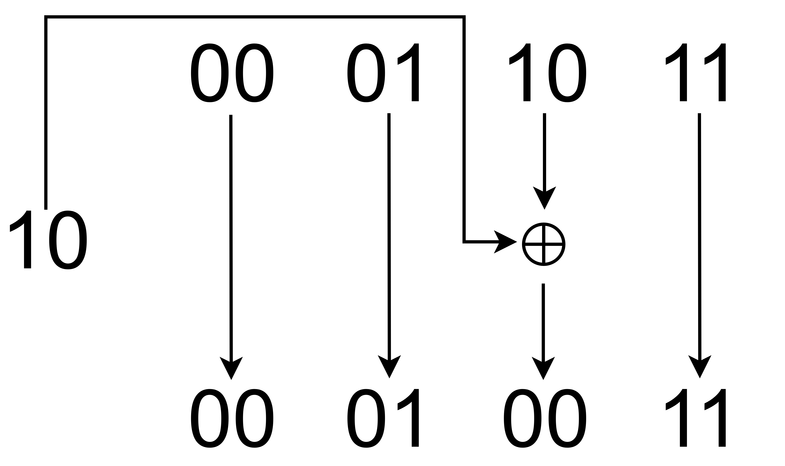

# Padding Oracle Attack

Block cipher algorithms (like AES) require input data to have a length that is multiple of the block size. In the case of AES, which is the focus of this write-up, 16 bytes. If the plaintext doesn't follow this requirement, padding must be added to adjust its length.

This attack relies on having a "padding oracle" who answers if a message was correctly padded or not. This information can be obtained directly, or through [side-channel attacks](https://en.wikipedia.org/wiki/Side-channel_attack).

With that information, a ciphertext can be decrypted without ever knowing the key, except for the first block (the first 16 bytes), which requires the [Initialization Vector (IV)](https://en.wikipedia.org/wiki/Initialization_vector) used during encryption.

*Kudos to flashs101 for inspiring this write-up is. Much of what follows is thanks to [his work](https://github.com/flast101/padding-oracle-attack-explained)*

## Table of Contents

- [Table of Contents](#table-of-contents)
- [Overview](#overview)
  - [Basic Concepts](#basic-concepts)
- [Usage](#usage)
  - [Repository Structure](#repository-structure)
  - [Configuration](#configuration)
- [Symmetric-Key Encryption](#symmetric-key-encryption)
  - [AES-CBC](#aes-cbc)
  - [Padding Algorithm](#padding-algorithm)
- [Who in the what now](#who-in-the-what-now)
  - [XOR Applied to Bytes](#xor-applied-to-bytes)
  - [Getting the Last Plaintext Byte](#getting-the-last-plaintext-byte)
  - [Second-to-Last Plaintext Byte](#second-to-last-plaintext-byte)
  - [Generalizing](#generalizing)

## Overview

Symmetric-key algorithms are cryptographic algorithms that use the same secret key for encryption and decryption operations. In contrast, asymmetric-key (or public-key) algorithms use two keys: a public (known) key to encrypt the messages and a private key to decrypt them.

The requirement that both parties have access to the secret key is one of the main drawbacks of symmetric-key encryption. That's why public-key algorithms are often used to exchange this secret.

Symmetric-key encryption can use either stream or block ciphers:

- **Stream ciphers**. Encrypts data as a continuous stream of bits or bytes, one at a time, using a pseudorandom keystream (a sequence of bytes or bits generated by the algorithm using a secret key).
- **Block ciphers**. Encrypts data in fixed-size blocks, padding the plaintext to achieve a multiple of the block size.

We'll focus on the latter.

### Basic Concepts

The following are some of the basic concepts required to understand this write-up:

- **Plaintext**: Any readable information presented in a format that is accessible and usable without any decryption, including binary data.
- **Ciphertext**: The encrypted version of the plaintext.
- **Cipher**: A cryptographic algorithm used to apply encryption or decryption operations to data.
- **Encryption**: Turns plaintext into ciphertext by using a cipher and a secret key.
- **Decryption**: Turns ciphertext into plaintext.

## Usage

First, install the dependencies. You can do that in a venv:

```shell
python3 -m venv .venv
source $(pwd)/.venv/bin/activate # Activates the venv
python3 -r src/requirements.txt
```

Once installed, you can run the script:

```shell
python3 src/main.py
```

Available params:

- `-p PLAINTEXT`, `--plaintext PLAINTEXT`. Plaintext to encrypt using AES-CBC mode (base64-encoded). If not provided, sample text is used.
- `-c CIPHERTEXT`, `--ciphertext CIPHERTEXT`. AES-CBC ciphertext to decrypt (base64-encoded). If not provided, sample text is used.
- `-i IV`, `--iv IV`. Vector for decrypting the first block (base64-encoded).
- `--use-native-padder`. Use `cryptography`'s implementation of the PKCS#7 padder.

If neither the plaintext or ciphertext are provided, the following plaintext will be used:

> The truth may be stretched thin, but it never breaks, and it always surfaces above lies, as oils floats on water.

Note that all input strings **must be Base64 encoded**. As an example, this is how you'd encode the IV:

```python
import base64
base64.b64encode(b'\x12\x87\xff\xaf\xe9kF\xd0\x89\xe0T\x9a\xfb5\xa5{').decode()
# Output: 'Eof/r+lrRtCJ4FSa+zWlew=='
```

To use it:

```shell
python3 src/main.py -i 'Eof/r+lrRtCJ4FSa+zWlew=='
```

### Repository Structure

The repo is structured as follows:

- `src/`
  - `main.py`: Contains the attack logic.
  - `oracle.py`: Simulates the server's oracle.
  - `pkcs7.py`: My own implementation of the PKCS7 padding algorithm.
  - `settings.py`: Configuration values.
  - `requirements.txt`

### Configuration

The following values are set in `src/settings.py`.

- `BLOCK_SIZE`: AES block size **in bytes**.
- `SAMPLE_TEXT`: Default plaintext used when no plaintext or ciphertext is given as input.
- `KEY`: Default encryption key.
- `IV`: Default IV.

Change them as you see fit.

## Symmetric-Key Encryption

A block cipher by itself can only securely transform fixed-size blocks of data. To encrypt messages of arbitrary length, we need to use a mode of operation, which defines how to process multiple blocks and handle padding.

Most modes of operations use an **Initialization Vector (IV)**, a unique binary sequence added to the encryption process. The IV adds randomness, ensuring that encrypting the same plaintext with the same key will produce different ciphertexts. This is important to avoid attackers from spotting patterns, making it easier to guess the original message, or find weaknesses in the encryption.

<p align="center">
    
</p>

There are many modes of operations, but the most common (for real) are these:

- **GCM (Galois/Counter Mode)**
- **CCM (Counter with CBC-MAC)**
- **SIV (Synthetic IV)**
- **GCM-SIV**
- **CBC (Cipher Block Chaining)**

Modes like ECB (Electronic Codebook) are avoided because they are vulnerable to pattern analysis and other attacks. Check [this section](https://en.wikipedia.org/wiki/Block_cipher_mode_of_operation#Electronic_codebook_(ECB)) on the Block cipher's wikipedia page to see how insecure it is.

### AES-CBC

The padding oracle attack is primarily based on the AES-CBC mode. By observing how a system responds to different ciphertext (the padding is valid or not) the attacker (us) will be able to gradually recover the plaintext without knowing the secret key.

Let's see how this mode of operation works.

During encryption, each plaintext block is [XORED](https://en.wikipedia.org/wiki/Exclusive_or) with the previous ciphertext block (or the IV for the first block), and then encrypted with the secret key.

Since each ciphertext block is dependent on the previous one, encryption **cannot be parallelized**.

<p align="center">
    
</p>

To decrypt, we simply reverse the process: first, decrypt each ciphertext block using the secret key, then XOR the result with the previous ciphertext block (or the IV for the first block). The recovers the original plaintext block.

<p align="center">
    
</p>

These operations can be represented as mathematical operations. Don't worry, they are fairly simple, and are only included here because **they are needed for this attack**. If not, I wouldn't bother.

For encryption:

```math
C_i = E_K(P_i \oplus C_{i-1})
```

where:

- $`C_i`$ is the ciphertext block
- $`E_K`$ is the AES-CBC encryption operation
- $`P_i`$ is the plaintext block
- $`C_{i-1}`$ is the previous ciphertext block, or $`IV`$ for the first block
- $`\oplus`$ means XOR

And the decryption formula is:

```math
P_i = D_K(C_i) \oplus C_{i-1}
```

We'll come to them in a second.

> One **very** important thing to note: XOR works on individual bits (and by extension, bytes). This means that if you change one bit (or byte), only that specific part is affect, **nothing else changes**.

### Padding Algorithm

Here's where the magic resides.

Many AES-CBC implementations use the PKCS#7 algorithm for padding, a simple yet elegant solution to this problem.

This algorithm works in a very simple way. If N is the numbers of bytes in a block and M bytes (M < N) are missing from the last block, it adds the character `0xM` (hexadecimal) M times at the end of the block.

<p align="center">
    
</p>

To simplify things, let's say we are working with blocks of 4 bytes, and we want to encrypt the following plaintext:

p = 'PURPLE'

Since our plaintext is 6 bytes long and the block size is 4, PKCS#7 needs to add 2 extra bytes to fill up the last block, like so:

p_padded = 'PURPLE\0x02\0x02'

If 3 extra bytes were needed it would add three `0x03`, for 4, 4 of `0x04`, ...

One important thing to note is that **PKCS#7 always add padding**, even if the plaintext's length is already a multiple of the block size.

Our plaintext now looks like this:

p = 'HOLA'

The plaintext is 4 bytes long, which is a multiple of 4, but because it always adds padding, a new block of `0x04` characters will be appended at the end:

p_padded = 'HOLA\0x04\0x04\0x04\0x04'

## Who in the what now

This quote from the simpsons illustrates WAY to well how the whole attack works. You'll get the why in a moment.

Now that we have the theoretical base in place, let's see how we can exploit the *Oracle* for our own benefit. To make things simpler, we are going to work with a small example using just 4 blocks. Meaning, we'll have 4 plaintext blocks and 4 ciphertext blocks. The block size will still be 16, we are on AES after all.

Let's illustrate this. For encryption we have:

<p align="center">
    
</p>

And decryption:

<p align="center">
    
</p>

Let's take another look at the (AES-CBC) decryption formula:

```math
P_i = D_K(C_i) \oplus C_{i-1}
```

Now, let's take X. This is a block that **we control** and can change as we please. This is the **base** for the **whole attack**.

<p align="center">
    
</p>

Expressing this with the previous formulas, we get:

- $`C_3 = E_K(P_3 \oplus C_2)`$
- $`P^{\prime}_1 = D_K(C_3) \oplus X`$

If we replace $`C_3`$, we have:

```math
P^{\prime}_1 = D_K(E_K(P_3 \oplus C_2)) \oplus X
```

Because decryption ($`D_K`$) and encryption ($`E_K`$) cancel each other out, and XOR is commutative, we get:

```math
P_3 = P^{\prime}_1 \oplus C_2 \oplus X
```

And we've gotten to a point where we have 2 knowns and 2 unknowns.

**Knowns**:

- $`C_2`$: Previous ciphertext block.
- $`X`$: Ciphertext block **we control**.

**Unknowns**:

- $`P_3`$: Last plaintext block.
- $`P^{\prime}_1`$: Last plaintext block from decrypting $`X || C_3`$ ($`||`$ means concatenation).

### XOR Applied to Bytes

XOR works on individual bits (and by extension, bytes). This means that if you change one bit (or byte), only that specific part is affected. And this is a very important concept for us.

Let's suppose we have the following sequence of numbers:

<p align="center">
    
</p>

We want to XOR this sequence so that only the number 27 is affected. If we apply a XOR between the binary $`10`$ and the binary representation of 27 ($`00011011`$), we get:

<p align="center">
    
</p>

We can go a step further and apply the $`10`$ binary XOR to just one pair of bits:

<p align="center">
    
</p>

Because XOR is applied on individual bytes (or bits), we can break down the previous $`P_3`$ formula into its byte-by-byte representation:

- $`P_{3[0]} = P^{\prime}_{1[0]} \oplus C_{2[0]} \oplus X{[0]}`$
- $`P_{3[1]} = P^{\prime}_{1[1]} \oplus C_{2[1]} \oplus X{[1]}`$
- $`...`$
- $`P_{3[15]} = P^{\prime}_{1[15]} \oplus C_{2[15]} \oplus X{[15]}`$

> We go up to 15 since the block size is 16 and we start counting at 0.

### Getting the Last Plaintext Byte

To get the last plaintext byte we need to resolve this formula (the one we just saw):

```math
P_{3[15]} = P^{\prime}_{1[15]} \oplus C_{2[15]} \oplus X_{[15]}
```

If we recall the explanation we saw earlier, we have two knowns and two unknowns, so let's focus on the one unknown we can get:

```math
P^{\prime}_{1[15]} = D_K(C_{3[15]}) \oplus X_{[15]}
```

The idea for the first iteration is to change the last byte of $`X`$ and send $`X || C_3`$ to the server. Because of how CBC mode works, the server will decrypt $`C_3`$ and XOR the result with our modified $`X`$ block. The result of this operation is the $`P^{\prime}_1`$ plaintext block. The server (our trusty oracle) then returns whether or not the padding of the last decrypted block ($`P^{\prime}_1`$) is correct (a valid PKCS#7 padding).

This is really interesting: if we can force the last plaintext block to have a specific padding (`0x01` for the first iteration), we can get these last plaintext bytes by just applying the $`P_3`$ formula!!

We can literally force the server to *reveal* the plaintext **WITHOUT EVER KNOWING THE KEY**!

Math baby, MATH.

For this first iteration we want to force the plaintext to have `0x01` padding ($`P^{\prime}_{1[15]} = 0x01`$). Why? Because we don't any plaintext bytes yet.

Because XOR works on bytes, we can simple try every possible value (0 to 255) for $`X_{[15]}`$ until the oracle tells us the padding is valid (or we don't get an error).

To make sure we're not accidentally hitting any existing padding, **we also need to change the previous byte** of $`C_{3[15]}`$, this is $`C_{3[14]}`$. That way, the only possible value for the padding is `0x01`.

Once we know which value makes $`P^{\prime}_{1[15]} = 0x01`$, we can use this formula to find the plaintext byte:

```math
P_{3[15]} = P^{\prime}_{1[15]} \oplus C_{2[15]} \oplus X_{[15]}
```

where:

- $`P^{\prime}_{1[15]}`$: `0x01` (the value we forced by changing $`X_{[15]}`$).
- $`C_{2[15]}`$: The corresponding byte from the previous ciphertext block.
- $`X_{[15]}`$: The value (0 to 255) that made $`P^{\prime}_{1[15]}`$ equal to `0x01`

### Second-to-Last Plaintext Byte

There are two formulas involved now:

- $`P_{3[15]} = P^{\prime}_{1[15]} \oplus C_{2[15]} \oplus X{[15]}`$
- $`P_{3[14]} = P^{\prime}_{1[14]} \oplus C_{2[14]} \oplus X{[14]}`$

We want to force $`P^{\prime}_1`$ to have a padding of two, meaning that:

```math
P^{\prime}_{1[15]} = P^{\prime}_{1[14]} = 0x02
```

However, we can't use the $`X{[15]}`$ we found earlier, as it was chosen to produce `0x01` padding, not `0x02`! But we **do have** $`P_{3[15]}`$, and because XOR is commutative, we get:

```math
X{[15]} = P^{\prime}_{1[15]} \oplus C_{2[15]} \oplus P_{3[15]}
```

where:

- $`P^{\prime}_{1[15]}`$: Is `0x02`
- $`C_{2[15]}`$: The corresponding byte from the previous ciphertext block.
- $`P_{3[15]}`$: Is the plaintext byte we calculated in the previous section.

With that in mind, we need to:

1. Calculate and update $`X{[15]}`$ based on the previous formula.
2. Scramble $`X{[13]}`$ (the byte before $`X{[14]}`$) to make sure the only possible padding is `0x02`.
3. Try every possible value (0 to 255) for $`X{[14]}`$ until the oracle says the padding is valid.

### Generalizing

To calculate any given plaintext byte ($`P_{i[j]}`$), we go through each byte in the corresponding ciphertext block ($`C_{i[j]}`$), starting from the last byte ($`j=15`$) and moving to the first ($`j=0`$).

For each position (byte), we calculate the right value for $`X_{[j]}`$ that produces valid padding, using the values we already found for the bytes after $`j`$.

Since plaintext bytes are calculated per-block, **this process can be parallelized**.

The following pseudocode illustrates this process:

```
For each block (except the first one):
    For j from 15 down to 0:
        - Set the padding value to (16 - j): 0x01, 0x02, ...
        - For all positions k>j, set X[k] so that P'[k] = padding (using formula1)
        - Try all possible values for X[j] (0 to 255) until the oracle says the padding is valid
        - Once found, calculate the plaintext byte using formula2
```

where:

- Formula1: $`X{[k]} = padding \oplus C_{i-1[k]} \oplus P_{i[k]}`$
- Formula2: $`P_{i[j]} = padding \oplus C_{i-1[j]} \oplus X{[j]}`$